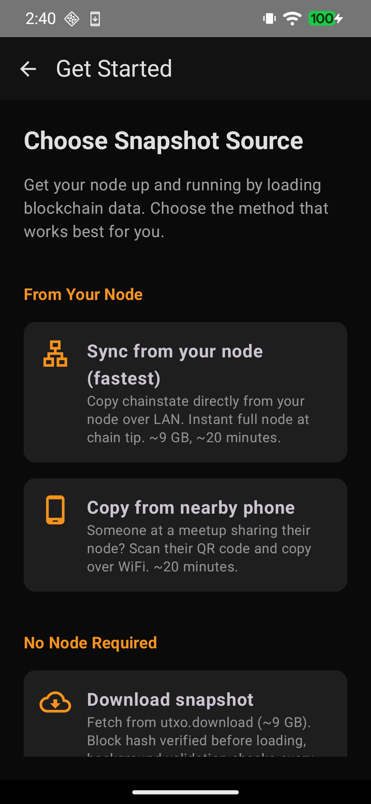
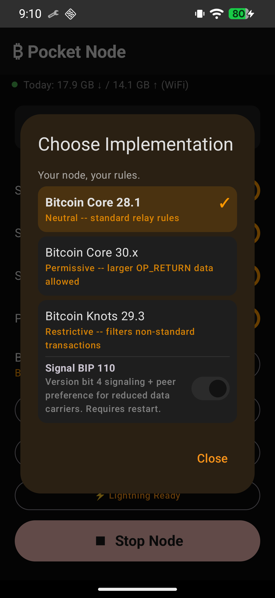
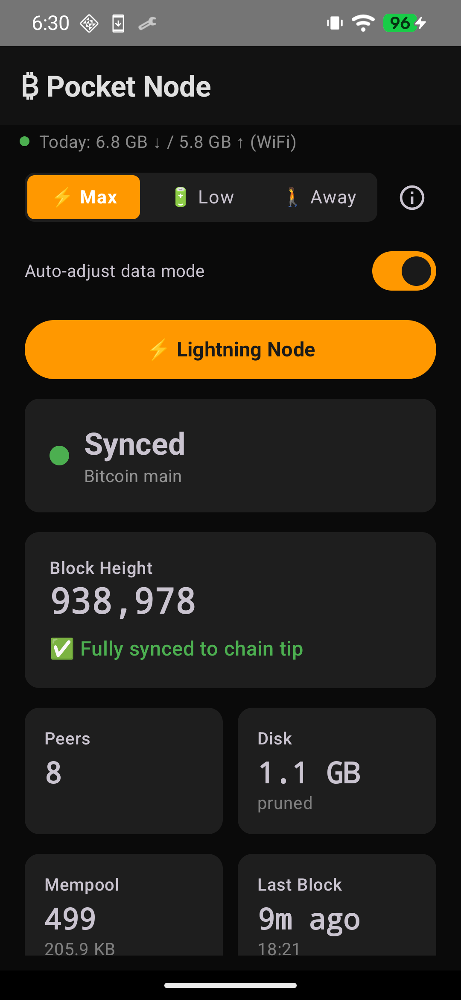
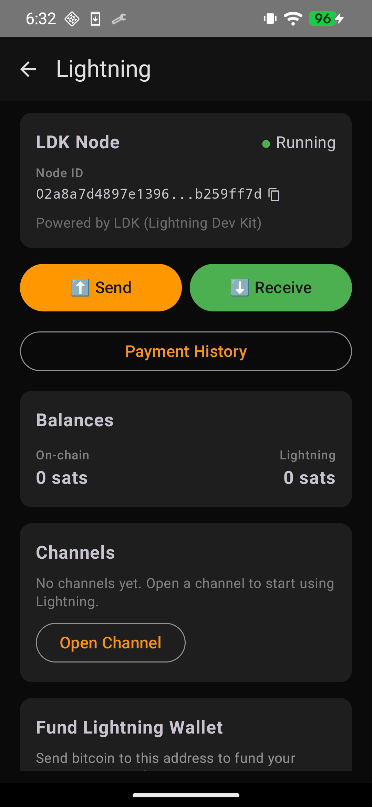
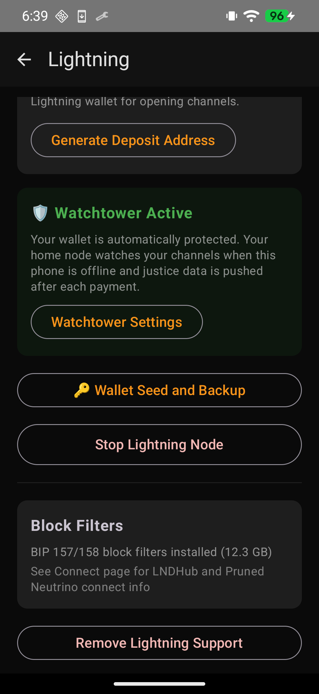
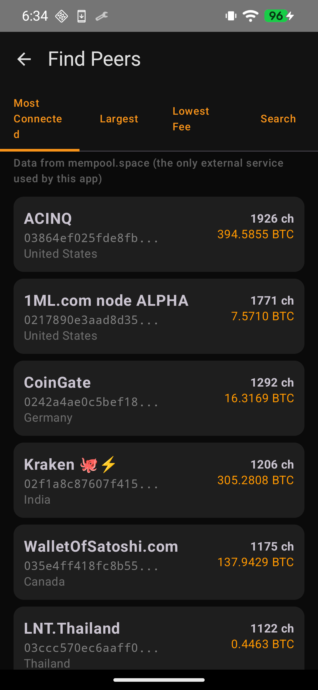

# Bitcoin Pocket Node

**Bitcoin node in your pocket in under 20 minutes.**

Turn any Android phone into a fully-validating Bitcoin full node. No server dependency, no ongoing tethering. Your phone becomes a sovereign Bitcoin node.

📖 **[Project overview and how chainstate copy works](https://freeonlineuser.github.io/bitcoin-pocket-node/)**

## ✅ Proven

- **Direct chainstate copy:** full node at chain tip in ~20 minutes (167M UTXOs, 4 peers, instant)
- **AssumeUTXO alternative:** full node in ~3 hours via cryptographically verified UTXO snapshot
- **3 Bitcoin implementations:** Core 28.1, Core 30, Knots 29.3 (with BIP 110 toggle). Switch with one tap, same chainstate
- Phone stays cool, runs overnight without issues
- ~26 GB total disk with Lightning (11 GB chainstate + 2 GB pruned blocks + 13 GB block filters), ~13 GB without
- **Pure Kotlin Electrum server** for BlueWallet on-chain connectivity to your own node
- **Built-in Lightning wallet** powered by LDK: send, receive, BOLT12 offers, open/close channels, peer browser, QR codes
- **LNDHub API** for external Lightning wallets (BlueWallet, Zeus)
- **Proactive prune recovery** re-downloads missed blocks on startup when node was offline
- **Embedded Tor** for direct .onion watchtower connections (no Orbot, no SSH tunnel needed)

## Screenshots

*Running on a Pixel 7 Pro with GrapheneOS*

**First run**

<table>
<tr>
<td align="center" width="33%"><strong>Setup screen</strong></td>
<td align="center" width="33%"><strong>Setup checklist</strong></td>
<td align="center" width="33%"><strong>Version picker</strong></td>
</tr>
<tr>
<td></td>
<td></td>
<td></td>
</tr>
</table>

**Node + On-chain wallet**

<table>
<tr>
<td align="center" width="33%"><strong>Electrum server</strong></td>
<td align="center" width="33%"><strong>BlueWallet connected</strong></td>
<td align="center" width="33%"><strong>BlueWallet wallet</strong></td>
</tr>
<tr>
<td></td>
<td></td>
<td></td>
</tr>
</table>

**Lightning Wallet**

<table>
<tr>
<td align="center" width="25%"><strong>Dashboard</strong></td>
<td align="center" width="25%"><strong>Lightning wallet</strong></td>
<td align="center" width="25%"><strong>Watchtower + Seed</strong></td>
<td align="center" width="25%"><strong>Peer browser</strong></td>
</tr>
<tr>
<td></td>
<td></td>
<td></td>
<td></td>
</tr>
</table>

## How It Works

Two bootstrap paths. Choose speed or trustlessness:

### ⚡ Path 1: Sync from Your Node (Direct Chainstate Copy) ~20 min
1. App connects to your home node (Umbrel, Start9, any Bitcoin node) via SSH
2. Briefly stops bitcoind, copies chainstate + block index + xor.dat + tip blocks
3. Creates stub files for historical blocks, starts bitcoind with `checklevel=0`
4. **Instant full node at chain tip.** No background validation, no catch-up

### 🔒 Path 2: Download from Internet (AssumeUTXO) ~3 hours
1. Download a UTXO snapshot (~9 GB) from your home node over LAN or the internet
2. App loads it via `loadtxoutset` (cryptographically verified by Bitcoin Core)
3. Phone syncs forward from the snapshot height (~25 min to load, ~2 hours to reach tip)
4. Background validation confirms everything independently from genesis

See [Direct Chainstate Copy](docs/direct-chainstate-copy.md) for a detailed comparison.

## Version Selection

Your node, your rules. Choose which Bitcoin implementation runs on your phone:

| Implementation | Size | Policy |
|---|---|---|
| **Bitcoin Core 28.1** | 13 MB | Neutral: standard relay rules |
| **Bitcoin Core 30** | 8.6 MB | Permissive: larger OP_RETURN data allowed |
| **Bitcoin Knots 29.3** | 9 MB | Restrictive: filters non-standard transactions. Optional BIP 110 toggle |

All three share the same chainstate format. Switch without re-syncing. Tap "Change" on the dashboard, confirm, and the node restarts with the new binary.

**BIP 110** ([bip110.dev](https://bip110.dev/)) temporarily limits arbitrary data embedding at the consensus level. When running Knots, a toggle enables version bit 4 signaling and peer preference for reduced data carriers. Built from Dathon Ohm's [reference implementation](https://github.com/bitcoinknots/bitcoin/compare/29.x-knots...dathonohm:bitcoin:uasf-modified-bip9) with a 55% activation threshold.

See [Version Selection Design](docs/VERSION-SELECTION.md) and [BIP 110 Research](docs/BIP110-RESEARCH.md) for details.

## Features

- **3 Bitcoin implementations** with one-tap switching: Core 28.1, Core 30, Knots 29.3 (BIP 110 toggle)
- **Two bootstrap paths:** direct chainstate copy (~20 min) or AssumeUTXO (~3 hours)
- **Pure Kotlin Electrum server** so BlueWallet can query your own node (no native dependencies)
- **Built-in Lightning node** powered by LDK (send, receive, channels, peer browser, seed backup/restore)
- **LNDHub API** on localhost:3000 for external wallet connectivity (BlueWallet, Zeus)
- **Home node watchtower** with automatic channel protection via LDK-to-LND bridge (direct Tor .onion or SSH fallback)
- **BOLT12 support:** send to offers, create reusable offers, variable-amount offers
- **QR codes:** generate on receive, scan with camera on send (CameraX + ZXing, no Google Play)
- **Sovereign price discovery** using UTXOracle (BTC/USD from on-chain data, no exchange APIs)
- **Mempool viewer** with fee estimates, projected blocks, and transaction search
- **Wallet setup guide** for BlueWallet connection
- **Snapshot validation** checks block hash before loading, auto-redownloads if wrong
- **Non-blocking snapshot load** with progress tracking
- **Network-aware sync** that auto-pauses on cellular and resumes on WiFi
- **VPN-aware networking:** Detects actual connection type behind VPN (cellular vs WiFi)
- **Data budgets** for WiFi and cellular
- **Power modes:** Max Data, Low Data, Away Mode with burst sync for mobile efficiency
- **Auto data mode:** detects WiFi/cellular and charging state, adjusts automatically
- **Battery saver** pauses sync when unplugged below 50%
- **Auto-start on boot**
- **Secure node pairing** with restricted SFTP account (no access to your bitcoin data)
- **Setup checklist** with auto-detection of completed steps
- **Live dashboard** showing block height, sync progress, peers, mempool, disk usage
- **Partial mempool** (50 MB) with persistence across restarts (survives nightly reboot)

## Snapshot Sources

### From Your Node (LAN)

#### Direct Chainstate Copy (fastest)
The app connects to your home node via SSH, briefly stops bitcoind, and copies:
- `chainstate/` (the UTXO set, ~11 GB)
- `blocks/index/` (block metadata, ~2 GB)
- `blocks/xor.dat` (block file obfuscation key)
- Tip block/rev files (latest block data)

Total transfer ~13 GB over LAN (~5 min). Node operational in ~20 minutes including setup.

#### AssumeUTXO Snapshot
1. Generates a UTXO snapshot using `dumptxoutset rollback`
2. Downloads via SFTP over LAN (~5 min for 9 GB)
3. Loads via `loadtxoutset`

The app tries saved `pocketnode` SFTP credentials first. If a snapshot already exists on the server, no admin credentials are needed.

### From Internet
Download from `https://utxo.download/utxo-910000.dat` (9 GB). Same `loadtxoutset` flow, just a different download source. The snapshot is cryptographically verified against the block hash compiled into Bitcoin Core before loading.

**Note:** This path provides an on-chain node only. Lightning support requires block filters (~13 GB) which can be added later by copying from a home node via SSH.

## Architecture

```
┌──────────────────────────────────────────────────┐
│              Android App (Kotlin)                │
│                                                  │
│  ┌──────────┐  ┌───────────┐  ┌───────────┐     │
│  │Chainstate│  │  Network  │  │   Sync    │     │
│  │ Manager  │  │  Monitor  │  │ Controller│     │
│  └────┬─────┘  └─────┬─────┘  └─────┬─────┘     │
│       │              │              │            │
│  ┌────┴──────────────┴──────────────┴─────────┐  │
│  │  bitcoind (ARM64), user selects:           │  │
│  │  Core 28.1 | Core 30 | Knots (+BIP 110)   │  │
│  │  Foreground service, local RPC             │  │
│  └────────────────┬───────────────────────────┘  │
│                   │ RPC                          │
│      ┌────────────┼────────────┐                 │
│      │            │            │                 │
│  ┌───┴──────┐ ┌───┴──────┐ ┌──┴───────────┐     │
│  │ Electrum │ │ ldk-node │ │   UTXOracle  │     │
│  │  :50001  │ │(in-proc) │ │  price feed  │     │
│  └───┬──────┘ └───┬──────┘ └──────────────┘     │
│      │            │                              │
│      │     ┌──────┴───────┐                      │
│      │     │  LNDHub API  │                      │
│      │     │   :3000      │                      │
│      │     └──────┬───────┘                      │
└──────┼────────────┼──────────────────────────────┘
       │            │
  BlueWallet    BlueWallet/Zeus
  (on-chain)    (Lightning)
```

## Security Model

### Node Pairing (SSH Setup)
When you pair with your home node, the app creates a restricted `pocketnode` user:

- **SFTP-only.** Cannot run commands, no shell access
- **Chroot jailed.** Can only see `/home/pocketnode/`, nothing else
- **Zero data access.** Cannot read your bitcoin data directory, wallet, configs, or logs
- **Root-owned copy scripts** bridge the gap, copying only snapshot files to the SFTP location

Admin SSH credentials are **never saved** (username is saved for pre-fill convenience). Always prompted, used once, discarded.

You can view the pocketnode credentials and **fully remove access** from the app at any time.

### Snapshot Verification
- Snapshots are verified against block hashes **compiled into the Bitcoin Core binary**
- The app also validates the snapshot file header before attempting to load
- A tampered or wrong-height snapshot is rejected before any data is used
- Background IBD independently validates everything from genesis (AssumeUTXO path)

### Android Security
- `network_security_config.xml` allows cleartext HTTP only to `127.0.0.1` (local RPC)
- bitcoind runs as `libbitcoind.so` in `jniLibs/` for GrapheneOS W^X compliance
- No internet-facing ports. RPC and Electrum server are both localhost only

## Lightning Support

Built-in Lightning wallet powered by [LDK](https://lightningdevkit.org/) (ldk-node 0.7.0). Runs in-process, connects to your local bitcoind via RPC. No external apps needed.

### How It Works
1. Start your Bitcoin node and wait for sync
2. Open the Lightning wallet from the dashboard
3. Fund your on-chain wallet (receive bitcoin to the displayed address)
4. Browse peers (Most Connected, Largest, Lowest Fee, or search) and open a channel
5. Send and receive Lightning payments

### Architecture

```
bitcoind ← RPC → ldk-node (in-process)
                    │
            ┌───────┴────────┐
            │                │
      Built-in UI      LNDHub API (:3000)
      (send/receive/        │
       channels)       External wallets
                       (BlueWallet, Zeus)
```

**Why LDK?** Earlier versions used Zeus with embedded LND, which required BIP 157/158 block filters and had a NODE_NETWORK service bit limitation with pruned nodes. LDK connects via RPC directly, so pruned nodes work natively. No service bit checks, no cross-app restrictions, no duplicate sync engine.

### External Wallet Support

The app runs an LNDHub-compatible API server on localhost:3000. Connect BlueWallet or Zeus in LNDHub mode to use your Lightning node from another app on the same phone.

### Peer Discovery

Built-in peer browser using mempool.space API. Browse nodes by:
- **Most Connected:** highest channel count
- **Largest:** biggest total capacity
- **Lowest Fee:** cheapest routing fees
- **Search:** find nodes by name or pubkey

## Target Platform

- **OS:** Android 7+ (tested on GrapheneOS, EMUI, Samsung OneUI)
- **Hardware:** Any ARM64 device (tested on Pixel, Samsung, Huawei)
- **Default:** Bitcoin Core v28.1 (non-controversial baseline)
- **Also bundled:** Core 30, Knots 29.3 with BIP 110 toggle (user selects from dashboard)
- **AssumeUTXO heights:** 840k (upstream) + 880k, 910k (backported from Core 30)

## Building

### Prerequisites
- macOS or Linux build machine
- Android SDK + NDK r27
- JDK 17
- Bitcoin Core v28.1 source (with chainparams patch)

### Build bitcoind for ARM64
See [docs/build-android-arm64.md](docs/build-android-arm64.md)

### Build the Android app
```bash
export ANDROID_HOME=/path/to/android-sdk
export JAVA_HOME=/path/to/jdk-17
./gradlew assembleDebug
```

### Install
```bash
adb install -r app/build/outputs/apk/debug/app-debug.apk
```

## App Structure

```
app/src/main/java/com/pocketnode/
├── service/
│   ├── BitcoindService.kt      # Foreground service managing bitcoind
│   ├── ElectrumService.kt      # Electrum server lifecycle management
│   └── SyncController.kt       # Network-aware sync pause/resume
├── lightning/
│   ├── LightningService.kt     # ldk-node wrapper (start/stop, channels, payments)
│   └── LndHubServer.kt         # LNDHub-compatible API server on localhost:3000
├── electrum/
│   ├── ElectrumServer.kt       # Electrum protocol TCP server
│   ├── ElectrumMethods.kt      # Electrum RPC method handlers
│   ├── AddressIndex.kt         # Descriptor wallet + address tracking
│   └── SubscriptionManager.kt  # Address/header subscription notifications
├── power/
│   └── PowerModeManager.kt     # Max/Low/Away power modes with burst sync
├── network/
│   └── NetworkMonitor.kt       # WiFi/cellular/VPN detection + data tracking
├── snapshot/
│   ├── ChainstateManager.kt    # AssumeUTXO snapshot flow (generate/download/load)
│   ├── BlockFilterManager.kt   # Lightning block filter copy/remove
│   ├── NodeSetupManager.kt     # SSH setup + teardown
│   └── SnapshotDownloader.kt   # SFTP download with progress
├── ssh/
│   └── SshUtils.kt             # Shared SSH/SFTP utilities
├── rpc/
│   └── BitcoinRpcClient.kt     # Local bitcoind JSON-RPC (configurable timeouts)
├── ui/
│   ├── PocketNodeApp.kt        # Navigation + top-level routing
│   ├── NodeStatusScreen.kt     # Main dashboard
│   ├── LightningScreen.kt      # Lightning node (balances, channels, watchtower status)
│   ├── SetupChecklistScreen.kt # Config mode setup wizard
│   ├── SnapshotSourceScreen.kt # Source picker
│   ├── ChainstateCopyScreen.kt # Snapshot load progress (4-step flow)
│   ├── ConnectWalletScreen.kt  # RPC / Electrum / LNDHub connection guide
│   ├── BlockFilterUpgradeScreen.kt # Lightning block filter management
│   ├── WatchtowerScreen.kt     # Home node watchtower setup
│   ├── DataUsageScreen.kt      # Data usage breakdown
│   ├── NetworkSettingsScreen.kt # Cellular/WiFi budgets
│   ├── NodeAccessScreen.kt     # View/remove node access
│   ├── NodeConnectionScreen.kt # Remote node connection setup
│   ├── InternetDownloadScreen.kt # HTTPS snapshot download
│   ├── lightning/
│   │   ├── SendPaymentScreen.kt    # Pay BOLT11 invoices
│   │   ├── ReceivePaymentScreen.kt # Generate invoices
│   │   ├── PaymentHistoryScreen.kt # Payment list
│   │   ├── OpenChannelScreen.kt    # Open channel to peer
│   │   ├── PeerBrowserScreen.kt    # Browse/search Lightning peers
│   │   ├── SeedBackupScreen.kt    # BIP39 seed view and restore
│   │   ├── QrCode.kt             # QR code generation (ZXing)
│   │   └── QrScannerScreen.kt    # Camera QR scanner (CameraX + ZXing)
│   ├── PowerModeSelector.kt    # Three-segment power mode toggle + burst banner
│   └── components/
│       ├── NetworkStatusBar.kt      # Sync status banner
│       └── AdminCredentialsDialog.kt # SSH creds prompt
├── lightning/
│   ├── LightningService.kt     # ldk-node singleton wrapper
│   ├── LndHubServer.kt         # LNDHub API server (:3000)
│   ├── WatchtowerBridge.kt     # LDK-to-LND watchtower push via SSH + Brontide
│   ├── WatchtowerNative.kt     # JNA bindings to native Rust watchtower client
│   └── Bip39.kt                # Pure Kotlin BIP39 (mnemonic ↔ entropy)
├── oracle/
│   └── UTXOracle.kt            # Sovereign price discovery from on-chain data
└── util/
    ├── ConfigGenerator.kt      # Mobile-optimized bitcoin.conf
    ├── BinaryExtractor.kt      # Version selection, 3 bundled bitcoind binaries
    └── SetupChecker.kt         # Auto-detect completed setup steps
```

## Documentation

- [Build Guide](docs/build-android-arm64.md)
- [Chainparams Patch](docs/chainparams-patch.md)
- [Direct Chainstate Copy](docs/direct-chainstate-copy.md)
- [Snapshot Testing](docs/snapshot-testing.md)
- [Umbrel Integration](docs/umbrel-integration.md)
- [Block Filter Design](docs/BLOCK-FILTER-DESIGN.md)
- [Block Index Consistency](docs/BLOCK-INDEX-CONSISTENCY.md)
- [Version Selection Design](docs/VERSION-SELECTION.md)
- [BIP 110 Research](docs/BIP110-RESEARCH.md)
- [LDK Research](docs/LDK-RESEARCH.md)
- [Watchtower Mesh Design](docs/WATCHTOWER-MESH.md)
- [LDK-to-LND Watchtower Bridge](docs/LDK-WATCHTOWER-BRIDGE.md)
- [Desktop Port Design](docs/DESKTOP-PORT.md)
- [Power Modes Design](docs/POWER-MODES.md)
- [Pruned Node Risk Analysis](docs/PRUNED-NODE-RISK-ANALYSIS.md)
- [LDK Upstream Contribution](docs/LDK-UPSTREAM-CONTRIBUTION.md)
- [Built-in Tor Design](docs/BUILT-IN-TOR.md)

## Roadmap

- **Phone-to-phone node sharing:** Share your validated chainstate and Lightning block filters over WiFi hotspot. One phone at a meetup bootstraps a whole table. See [design doc](docs/PHONE-TO-PHONE.md)
- **LDK upstream contribution:** improving watchtower API in rust-lightning ChannelMonitor ([#813](https://github.com/lightningdevkit/ldk-node/issues/813)). Draft PR submitted.
- **Desktop port:** Same app on Linux, macOS, Windows via Compose Multiplatform. See [design doc](docs/DESKTOP-PORT.md)
- **Tor for RGS and peer connections:** route Lightning gossip and peer traffic through embedded Arti

## Tested On

| Device | SoC | OS | Result |
|--------|-----|----|--------|
| Pixel 9 | Tensor G4 | GrapheneOS | ✅ Full stack: chainstate copy, LDK Lightning, BIP 110, all features verified |
| Samsung Galaxy Z Fold | Snapdragon | Android | ✅ Dual-pane foldable layout working, IBD syncing |
| Huawei Mate 20 Lite | Kirin 710 | EMUI | ✅ Clean install, IBD syncing from genesis |

## Known Issues

- 16KB page alignment warning on GrapheneOS (cosmetic only)
- `getblockchaininfo` reports background validation progress, not snapshot chain tip (AssumeUTXO path only)
- ARM64 Android emulator cannot run on x86 Mac, all testing requires real device

## License

MIT
