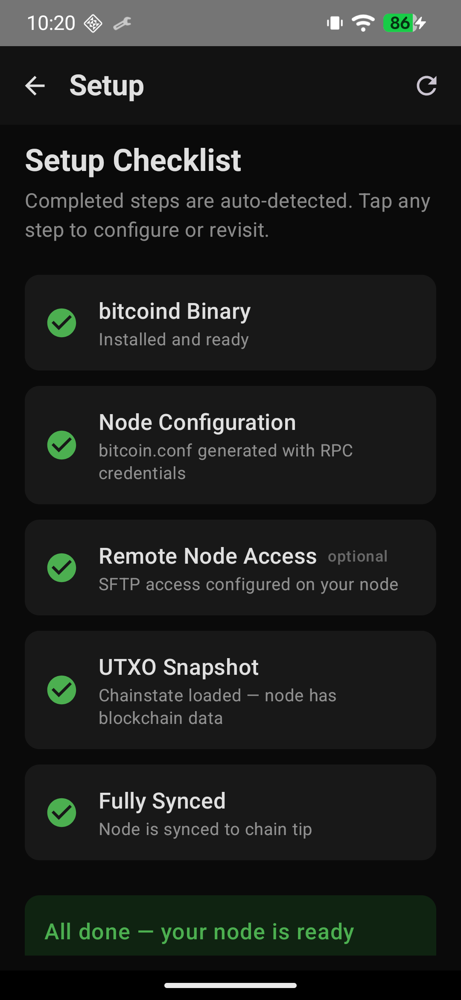
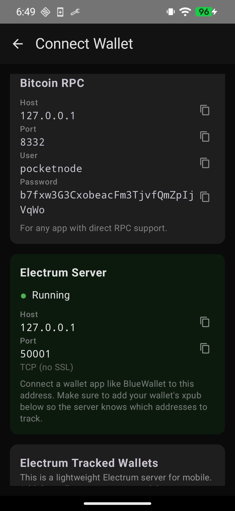
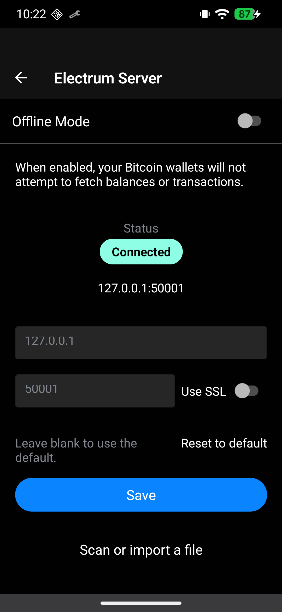
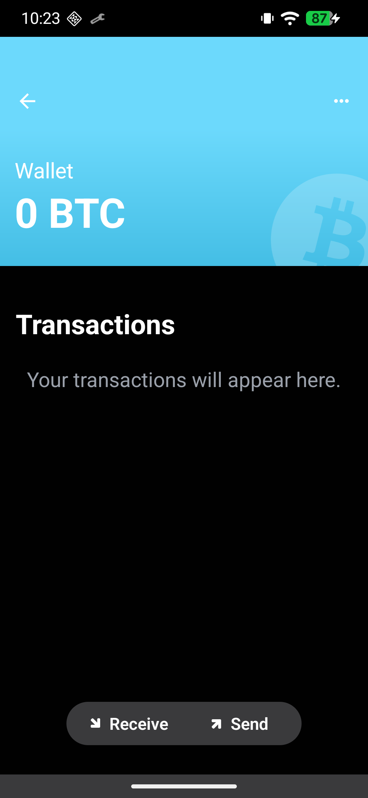
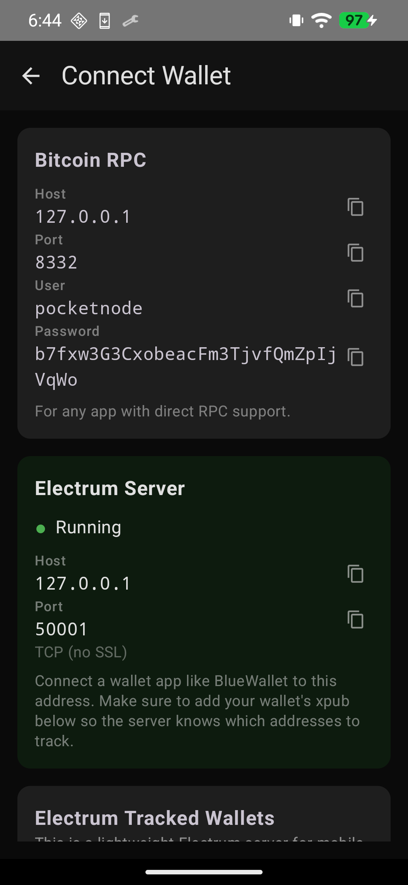
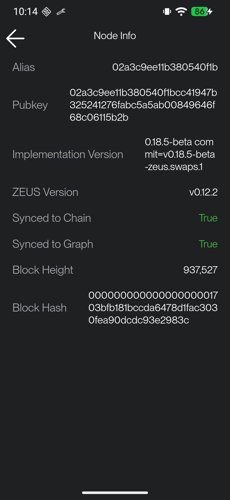
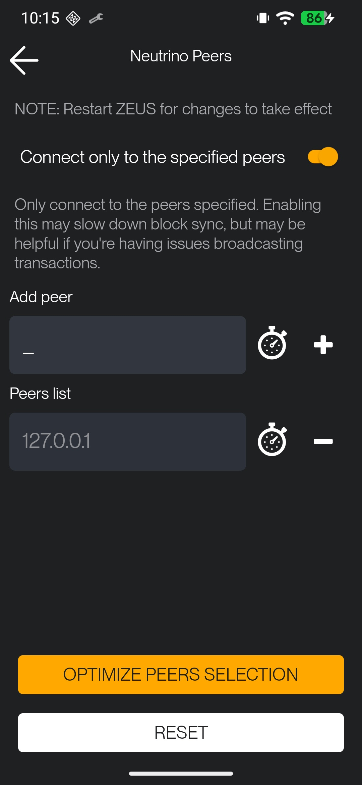

# Bitcoin Pocket Node

**Bitcoin node in your pocket in under 20 minutes.**

Turn any Android phone into a fully-validating Bitcoin full node. No server dependency, no ongoing tethering. Your phone becomes a sovereign Bitcoin node.

## ✅ Proven

- **Direct chainstate copy:** full node at chain tip in ~20 minutes (167M UTXOs, 4 peers, instant)
- **AssumeUTXO alternative:** full node in ~3 hours via cryptographically verified UTXO snapshot
- **4 Bitcoin implementations:** Core 28.1, Core 30, Knots 29.3, Knots BIP 110. Switch with one tap, same chainstate
- Phone stays cool, runs overnight without issues
- ~26 GB total disk with Lightning (11 GB chainstate + 2 GB pruned blocks + 13 GB block filters), ~13 GB without
- **BWT Electrum server** for BlueWallet connectivity to your own node

## Screenshots

*Running on a Pixel 7 Pro with GrapheneOS*

**Node + On-chain wallet**

| Setup checklist | Electrum server | BlueWallet connected | BlueWallet wallet |
|:---:|:---:|:---:|:---:|
|  |  |  |  |

**Lightning**

| Lightning enabled | Connect Wallet | Zeus synced | Zeus Neutrino peer |
|:---:|:---:|:---:|:---:|
|  |  |  |  |

**Choose your implementation**

| Version picker | Zeus setup guide |
|:---:|:---:|
|  |  |

## How It Works

Two bootstrap paths. Choose speed or trustlessness:

### ⚡ Path 1: Sync from Your Node (Direct Chainstate Copy) ~20 min
1. App connects to your home node (Umbrel, Start9, any Bitcoin node) via SSH
2. Briefly stops bitcoind, copies chainstate + block index + xor.dat + tip blocks
3. Creates stub files for historical blocks, starts bitcoind with `checklevel=0`
4. **Instant full node at chain tip.** No background validation, no catch-up

### 🔒 Path 2: Download from Internet (AssumeUTXO) ~3 hours
1. Download a UTXO snapshot (~9 GB) from your home node over LAN or the internet
2. App loads it via `loadtxoutset` (cryptographically verified by Bitcoin Core)
3. Phone syncs forward from the snapshot height (~25 min to load, ~2 hours to reach tip)
4. Background validation confirms everything independently from genesis

See [Direct Chainstate Copy](docs/direct-chainstate-copy.md) for a detailed comparison.

## Version Selection

Your node, your rules. Choose which Bitcoin implementation runs on your phone:

| Implementation | Size | Policy |
|---|---|---|
| **Bitcoin Core 28.1** | 13 MB | Neutral: standard relay rules |
| **Bitcoin Core 30** | 8.6 MB | Permissive: larger OP_RETURN data allowed |
| **Bitcoin Knots 29.3** | 9 MB | Restrictive: filters non-standard transactions |
| **Bitcoin Knots (BIP 110)** | 9 MB | Enforcement: consensus-level data restrictions, bit 4 signaling |

All four share the same chainstate format. Switch without re-syncing. Tap "Change" on the dashboard, confirm, and the node restarts with the new binary.

**BIP 110** ([bip110.dev](https://bip110.dev/)) temporarily limits arbitrary data embedding at the consensus level. Built from Dathon Ohm's [reference implementation](https://github.com/bitcoinknots/bitcoin/compare/29.x-knots...dathonohm:bitcoin:uasf-modified-bip9), signaling version bit 4 with a 55% activation threshold.

See [Version Selection Design](docs/VERSION-SELECTION.md) and [BIP 110 Research](docs/BIP110-RESEARCH.md) for details.

## Features

- **4 Bitcoin implementations** with one-tap switching: Core 28.1, Core 30, Knots 29.3, Knots BIP 110
- **Two bootstrap paths:** direct chainstate copy (~20 min) or AssumeUTXO (~3 hours)
- **BWT Electrum server** so BlueWallet can query your own node
- **Lightning support** via block filter copy from your home node, enabling Zeus Neutrino on localhost
- **Sovereign price discovery** using UTXOracle (BTC/USD from on-chain data, no exchange APIs)
- **Mempool viewer** with fee estimates, projected blocks, and transaction search
- **Wallet setup guide** for BlueWallet and Zeus connection
- **Snapshot validation** checks block hash before loading, auto-redownloads if wrong
- **Non-blocking snapshot load** with progress tracking
- **Network-aware sync** that auto-pauses on cellular and resumes on WiFi
- **VPN support:** WireGuard/VPN connections treated as WiFi
- **Data budgets** for WiFi and cellular
- **Battery saver** pauses sync when unplugged below 50%
- **Auto-start on boot**
- **Secure node pairing** with restricted SFTP account (no access to your bitcoin data)
- **Setup checklist** with auto-detection of completed steps
- **Live dashboard** showing block height, sync progress, peers, mempool, disk usage
- **Partial mempool** (50 MB) with persistence across restarts (survives nightly reboot)

## Snapshot Sources

### From Your Node (LAN)

#### Direct Chainstate Copy (fastest)
The app connects to your home node via SSH, briefly stops bitcoind, and copies:
- `chainstate/` (the UTXO set, ~11 GB)
- `blocks/index/` (block metadata, ~2 GB)
- `blocks/xor.dat` (block file obfuscation key)
- Tip block/rev files (latest block data)

Total transfer ~13 GB over LAN (~5 min). Node operational in ~20 minutes including setup.

#### AssumeUTXO Snapshot
1. Generates a UTXO snapshot using `dumptxoutset rollback`
2. Downloads via SFTP over LAN (~5 min for 9 GB)
3. Loads via `loadtxoutset`

The app tries saved `pocketnode` SFTP credentials first. If a snapshot already exists on the server, no admin credentials are needed.

### From Internet
Download from `https://utxo.download/utxo-910000.dat` (9 GB). Same `loadtxoutset` flow, just a different download source. The snapshot is cryptographically verified against the block hash compiled into Bitcoin Core before loading.

**Note:** This path provides an on-chain node only. Lightning support requires block filters (~13 GB) which can be added later by copying from a home node via SSH.

## Architecture

```
┌─────────────────────────────────────────────┐
│           Android App (Kotlin)              │
│                                             │
│  ┌──────────┐ ┌───────────┐ ┌───────────┐  │
│  │ Chainstate│ │  Network  │ │   Sync    │  │
│  │ Manager  │ │  Monitor  │ │ Controller│  │
│  └────┬─────┘ └─────┬─────┘ └─────┬─────┘  │
│       │             │             │         │
│  ┌────┴─────────────┴─────────────┴──────┐  │
│  │  bitcoind (ARM64), user selects:      │  │
│  │  Core 28.1 | Core 30 | Knots | BIP110│  │
│  │  Foreground service, local RPC        │  │
│  └──────────────┬────────────────────────┘  │
│                 │                           │
│  ┌──────────────┴──────────────────┐        │
│  │     BWT (Electrum server)       │        │
│  │     Local Electrum protocol     │        │
│  └──────────────┬──────────────────┘        │
│                 │                           │
└─────────────────┼───────────────────────────┘
                  │
     ┌────────────┼────────────┐
     │            │            │
Bitcoin P2P   BlueWallet   Electrum
 Network      (local)      clients
```

## Security Model

### Node Pairing (SSH Setup)
When you pair with your home node, the app creates a restricted `pocketnode` user:

- **SFTP-only.** Cannot run commands, no shell access
- **Chroot jailed.** Can only see `/home/pocketnode/`, nothing else
- **Zero data access.** Cannot read your bitcoin data directory, wallet, configs, or logs
- **Root-owned copy scripts** bridge the gap, copying only snapshot files to the SFTP location

Admin SSH credentials are **never saved** (username is saved for pre-fill convenience). Always prompted, used once, discarded.

You can view the pocketnode credentials and **fully remove access** from the app at any time.

### Snapshot Verification
- Snapshots are verified against block hashes **compiled into the Bitcoin Core binary**
- The app also validates the snapshot file header before attempting to load
- A tampered or wrong-height snapshot is rejected before any data is used
- Background IBD independently validates everything from genesis (AssumeUTXO path)

### Android Security
- `network_security_config.xml` allows cleartext HTTP only to `127.0.0.1` (local RPC)
- bitcoind runs as `libbitcoind.so` in `jniLibs/` for GrapheneOS W^X compliance
- No internet-facing ports. RPC and BWT Electrum are both localhost only

## Lightning Support (Zeus)

The app can copy BIP 157/158 block filter indexes (~13 GB) from your home node, enabling Zeus to run as a fully sovereign Lightning wallet. Everything stays on localhost with no external dependencies.

### How It Works
1. Tap "Add Lightning Support" on the dashboard
2. Enter your home node SSH credentials
3. The app detects block filters on your node, stops it briefly, archives filters alongside chainstate, downloads everything, and restarts your home node
4. Your phone's bitcoind restarts with `blockfilterindex=1`, `peerblockfilters=1`, `listen=1`, `bind=127.0.0.1`
5. Zeus connects via Neutrino to `127.0.0.1` for compact block filters

### Zeus Setup
1. Install **Zeus v0.12.2** from [GitHub releases](https://github.com/ZeusLN/zeus/releases/tag/v0.12.2) (v0.12.3+ has a [SQLite bug](https://github.com/ZeusLN/zeus/issues/3672) that stalls sync at block 123,000)
2. Open Zeus, select **Create embedded LND**
3. Wait ~15 minutes on the boot animation while initial header sync completes (don't change settings yet)
4. Restart the app
5. Wait for the warning icon to appear at the top of the screen
6. Tap the warning icon to open node settings
7. Go to **Embedded node > Peers > Neutrino Peers**
8. Delete all default Neutrino peers
9. Add `127.0.0.1` as the only Neutrino peer
10. Restart Zeus. It connects to your local bitcoind and the wallet appears
11. To confirm: **Settings > Embedded node > Peers > Neutrino Peers** should show `127.0.0.1` as the only peer

### Full Sovereign Stack
```
bitcoind (phone) --> block filters --> Zeus Neutrino --> Lightning wallet
         all on localhost, zero external dependencies
```

## Target Platform

- **OS:** GrapheneOS (or any Android 10+)
- **Hardware:** Google Pixel devices (ARM64)
- **Default:** Bitcoin Core v28.1 (non-controversial baseline)
- **Also bundled:** Core 30, Knots 29.3, Knots BIP 110 (user selects from dashboard)
- **AssumeUTXO heights:** 840k (upstream) + 880k, 910k (backported from Core 30)

## Building

### Prerequisites
- macOS or Linux build machine
- Android SDK + NDK r27
- JDK 17
- Bitcoin Core v28.1 source (with chainparams patch)

### Build bitcoind for ARM64
See [docs/build-android-arm64.md](docs/build-android-arm64.md)

### Build the Android app
```bash
export ANDROID_HOME=/path/to/android-sdk
export JAVA_HOME=/path/to/jdk-17
./gradlew assembleDebug
```

### Install
```bash
adb install -r app/build/outputs/apk/debug/app-debug.apk
```

## App Structure

```
app/src/main/java/com/pocketnode/
├── service/
│   ├── BitcoindService.kt      # Foreground service managing bitcoind
│   ├── BwtService.kt           # BWT Electrum server service
│   └── SyncController.kt       # Network-aware sync pause/resume
├── network/
│   └── NetworkMonitor.kt       # WiFi/cellular/VPN detection + data tracking
├── snapshot/
│   ├── ChainstateManager.kt    # AssumeUTXO snapshot flow (generate/download/load)
│   ├── BlockFilterManager.kt   # Lightning block filter copy/remove
│   ├── NodeSetupManager.kt     # SSH setup + teardown
│   └── SnapshotDownloader.kt   # SFTP download with progress
├── ssh/
│   └── SshUtils.kt             # Shared SSH/SFTP utilities
├── rpc/
│   └── BitcoinRpcClient.kt     # Local bitcoind JSON-RPC (configurable timeouts)
├── ui/
│   ├── PocketNodeApp.kt        # Navigation + top-level routing
│   ├── NodeStatusScreen.kt     # Main dashboard
│   ├── SetupChecklistScreen.kt # Config mode setup wizard
│   ├── SnapshotSourceScreen.kt # Source picker
│   ├── ChainstateCopyScreen.kt # Snapshot load progress (4-step flow)
│   ├── ConnectWalletScreen.kt  # BlueWallet / Electrum / Zeus wallet connection guide
│   ├── BlockFilterUpgradeScreen.kt # Lightning block filter management
│   ├── DataUsageScreen.kt      # Data usage breakdown
│   ├── NetworkSettingsScreen.kt # Cellular/WiFi budgets
│   ├── NodeAccessScreen.kt     # View/remove node access
│   ├── NodeConnectionScreen.kt # Remote node connection setup
│   └── components/
│       ├── NetworkStatusBar.kt      # Sync status banner
│       └── AdminCredentialsDialog.kt # SSH creds prompt
├── oracle/
│   └── UTXOracle.kt            # Sovereign price discovery from on-chain data
└── util/
    ├── ConfigGenerator.kt      # Mobile-optimized bitcoin.conf
    ├── BinaryExtractor.kt      # Version selection, 4 bundled bitcoind binaries
    └── SetupChecker.kt         # Auto-detect completed setup steps
```

## Documentation

- [Build Guide](docs/build-android-arm64.md)
- [Chainparams Patch](docs/chainparams-patch.md)
- [Direct Chainstate Copy](docs/direct-chainstate-copy.md)
- [Snapshot Testing](docs/snapshot-testing.md)
- [Umbrel Integration](docs/umbrel-integration.md)
- [Block Filter Design](docs/BLOCK-FILTER-DESIGN.md)
- [Block Index Consistency](docs/BLOCK-INDEX-CONSISTENCY.md)
- [Version Selection Design](docs/VERSION-SELECTION.md)
- [BIP 110 Research](docs/BIP110-RESEARCH.md)
- [LDK Research](docs/LDK-RESEARCH.md)
- [Watchtower Mesh Design](docs/WATCHTOWER-MESH.md)
- [Desktop Port Design](docs/DESKTOP-PORT.md)

## Roadmap

- **Desktop port:** Same app on Linux, macOS, Windows via Compose Multiplatform. Same UI, same chainstate copy, same version selection. See [design doc](docs/DESKTOP-PORT.md).
- **Home node watchtower:** Your home node watches your phone's Lightning channels when you're away. Enabled automatically during setup. See [design doc](docs/WATCHTOWER-MESH.md).
- **Policy settings:** Expose Knots datacarrier flags as toggleable settings.
- **LDK migration:** Replace Zeus embedded LND with LDK for native Lightning.

## Tested On

| Device | SoC | Result |
|--------|-----|--------|
| Pixel 7 Pro | Tensor G2 | ✅ Direct chainstate copy to chain tip, 167M UTXOs loaded via AssumeUTXO, phone stays cool |

## Known Issues

- 16KB page alignment warning on GrapheneOS (cosmetic only)
- `getblockchaininfo` reports background validation progress, not snapshot chain tip (AssumeUTXO path only)
- ARM64 Android emulator cannot run on x86 Mac, all testing requires real device
- Direct chainstate copy: pruning ~5000 stub files takes ~15 minutes on first startup (optimizable)

## License

MIT
